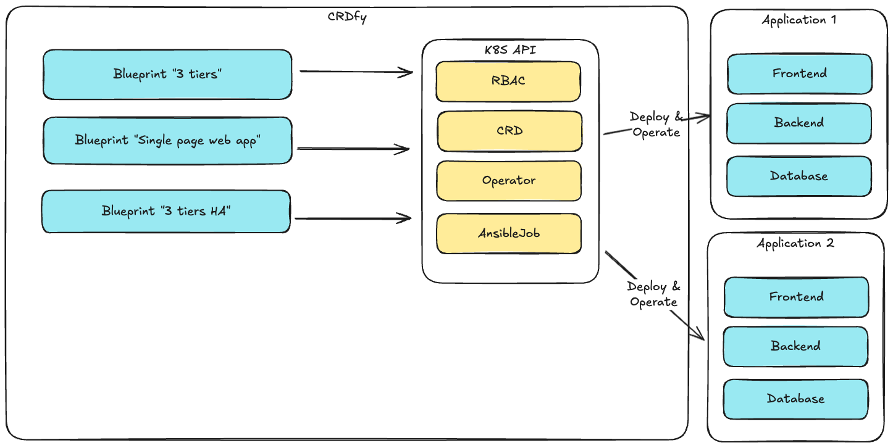

# CRDfy, the K8s ansible executor.

make undeploy &&  docker buildx build --platform linux/amd64 . -t galaxy.lan/controller:latest --push && make deploy

**when Ansible meets kubernetes** 

_Less is more_ 

The **CRDfy** project is based on the awx-ressources-operator. However, instead of managing a separate AWX / AAP instance, it will perform all those actions in a k8s native way, expanding on operators and custom ressources. 

AWX / AAP are fairly opinionated tools. The goal of this exercice is to demonstrate that a declarative approach can be taken to reliably and efficiently build a similar infrastructure with low efforts thanks to K8S expandable capabilites through operators and CRD.

# Concept 

Re-use your existing deployment mechanism. Build new standard paths to deploy your application. Integrate with your processes and stay in control !

# Dependencies 

## execution environements

In order to execute ansible from containers, you will need to build an image that fits your needs. We will share a basic example here to get you started once it ready.

## VM connectivity 

You certainly have some mechanism already in place to connect to a VM such as SSH for Linux based VMs. We will share a simple setup of Hashicorp vault enabling you to sign freshly generated Keys and gain access temporarily to those VMs for your deployment or operation on the system. 

## Ansible Galaxy

Ansible Galaxy is a great tool to add governance around your collections and playbooks. We highly recommend the usage of Ansible Galaxy as a repository for ansible artefacts. That said,  most - if not all -  repository tooling and concepts can be leveraged. 

## Auditing 

Large companies are sometimes under strong auditing requirements. We will share a simple example on what this solution can accomplish. 

## Monitoring 

kubectl apply -f https://raw.githubusercontent.com/open-telemetry/opentelemetry-collector/v0.135.0/examples/k8s/otel-config.yaml

